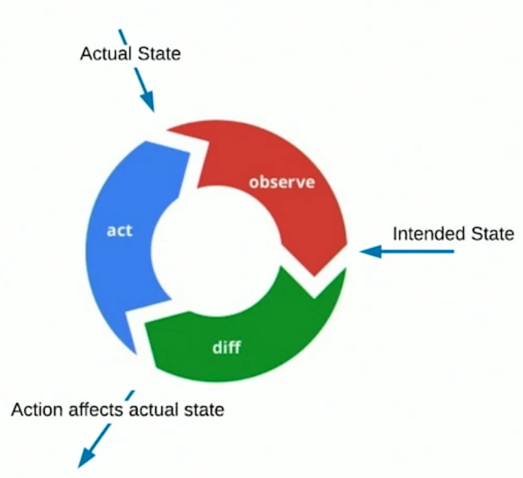

## Kubernates 

### Kubernates Controller

* Control Loops are basic building blocks of Contoller and Scheduler in K8s. These are the cornorstone of K8s.
* Control loops Observe the Difference in Actual State and Act to move it to the requested Desired State
* Controller Runs the Control loop

 

### References
* https://www.youtube.com/watch?v=OZdTIlb5q2Q
